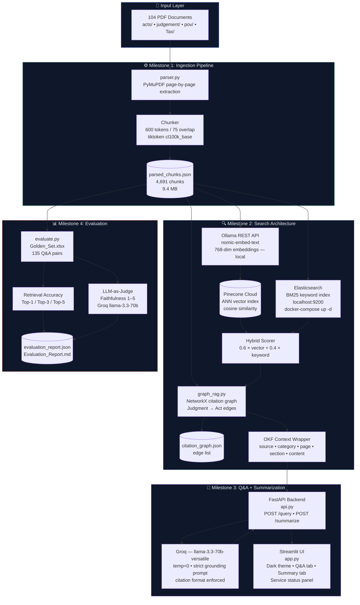

# Legal & Tax RAG System — Architecture

## System Architecture



---

## Data Flow

```
PDF Files
  │
  ▼
[parser.py]  →  PyMuPDF (text per page)  →  tiktoken chunker  →  parsed_chunks.json
                                                                          │
                                          ┌───────────────────────────────┤
                                          │                               │
                                          ▼                               ▼
                                    [search.py]                    [graph_rag.py]
                                  Embeddings: Ollama              Citation graph
                                  (nomic-embed-text, 768-dim)     NetworkX DiGraph
                                  Vector:   Pinecone               ↕ JSON edge list
                                  Keyword:  Elasticsearch BM25
                                  Hybrid:   0.6v + 0.4k
                                          │                               │
                                          └───────────────────────────────┘
                                                          │
                                                          ▼
                                                  OKF Context Wrapper
                                          {source, category, page, section, content}
                                                          │
                                                          ▼
                                               [api.py / FastAPI]
                                                          │
                                                  ┌───────┴────────┐
                                                  ▼                ▼
                                            POST /query     POST /summarize
                                                  │
                                                  ▼
                                     Groq — llama-3.3-70b-versatile (temp=0)
                                     STRICT GROUNDING PROMPT + citations
                                                  │
                                       ┌──────────┴──────────┐
                                       ▼                     ▼
                                  Answer text         Source citations
                              [doc_name, page, score]
                                       │
                                       ▼
                               [Streamlit UI - app.py]
```

---

## Key Design Decisions

| Component | Choice | Rationale |
|-----------|--------|-----------|
| PDF parser | PyMuPDF (fitz) | Fastest, handles complex legal document layouts |
| Tokenizer | tiktoken cl100k_base | Accurate token counting for chunk sizing |
| Chunk size | 600 tokens / 75 overlap | Balances context richness vs. retrieval precision |
| Embeddings | Ollama nomic-embed-text (768-dim) | Free, local, no API calls, strong semantic quality |
| Vector store | Pinecone (serverless, cosine) | Cloud-hosted ANN, handles 4,691+ vectors reliably |
| Keyword search | Elasticsearch 8.x (BM25, English analyzer) | Exact legal term matching (§ numbers, IRC citations, case names) |
| Hybrid weights | 0.6 vector / 0.4 keyword | Configurable; keyword critical for exact legal references |
| Graph RAG | NetworkX DiGraph | Links Judgments→Acts via §-references; enriches retrieval context |
| LLM | Groq llama-3.3-70b-versatile | High-speed inference, OpenAI-compatible API, temperature=0 |
| Anti-hallucination | System prompt + OKF | Every claim must be traceable to a source chunk |
| Evaluation | Golden Set (135 Q&A) + LLM-as-judge | Measures retrieval accuracy (Top-1/3/5) + faithfulness (1-5) |

---

## Stack Summary

| Layer | Tool | Type |
|-------|------|------|
| Embeddings | Ollama nomic-embed-text | Local |
| Vector DB | Pinecone (serverless) | Cloud |
| Keyword Search | Elasticsearch 8.x | Local (Docker) |
| LLM | Groq llama-3.3-70b-versatile | Cloud API |
| UI | Streamlit | Local |
| API | FastAPI + Uvicorn | Local |
| Graph | NetworkX | In-memory |

---

## File Structure

```
Legal_Tax_RAG_System/
├── data/
│   ├── acts/            (30 PDF files — 26 USC sections)
│   ├── judgement/       (30 PDF files — Tax Court cases)
│   ├── pov/             (30 PDF files — Tax Foundation POV)
│   └── Tax/             (10 PDF files — IRS Publications)
├── src/
│   ├── parser.py        # M1: PDF ingestion + chunking
│   ├── search.py        # M2: Hybrid vector (Pinecone) + keyword (ES) search + OKF
│   ├── graph_rag.py     # M2: Citation graph (NetworkX)
│   ├── api.py           # M3: FastAPI backend
│   ├── app.py           # M3: Streamlit UI
│   └── evaluate.py      # M4: Evaluation pipeline
├── tests/
│   └── test_system.py   # Unit + integration tests
├── outputs/
│   ├── parsed_chunks.json      (4,691 chunks, 9.4 MB)
│   ├── citation_graph.json     (NetworkX edge list)
│   └── evaluation_report.json  (M4 output)
├── docs/
│   ├── architecture.md         (this file)
│   └── Evaluation_Report.md    (M4 output)
├── docker-compose.yml  (Elasticsearch single-node)
├── Golden_Set.xlsx     (135 Q&A pairs for evaluation)
├── requirements.txt
├── .env.example        (template — safe to commit)
└── .env                (real keys — gitignored)
```
